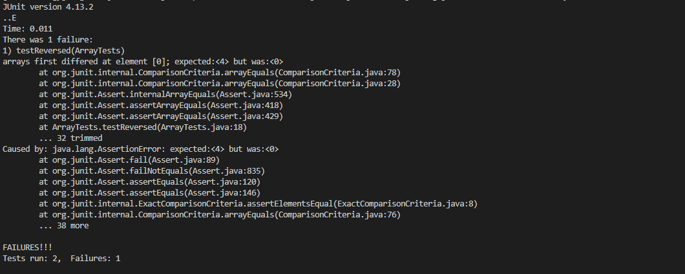

*Lab Report5*

In this final lab, i choose to finish my lab2 that some concept point i couln't finish.

Here is my code i write for SearchEngine

I make some breakpoint to discuss values of variables, fields, and arguments.

For the first breakpoint at line 8, after we create instance String varible, in our constructor we create an String object.

At second breakpoint, we are looking for our path matches with *"/add-message"*, if so, we could start our searchengine by adding the String like picture below

Since this is last lab report, we are learning much more then before.

In week 3's lab, i can remotely to editor the Junit test file now. by doint *nano* command, it allows me to editor and run more simply!

For example In week 3 we can run Test file by compile and run Junit

and we see all test case pass!

now i deal with the case to let code fail, i can simply use *nano* to editor on remote server

and we can see, the code is file in Test file we just editor!

